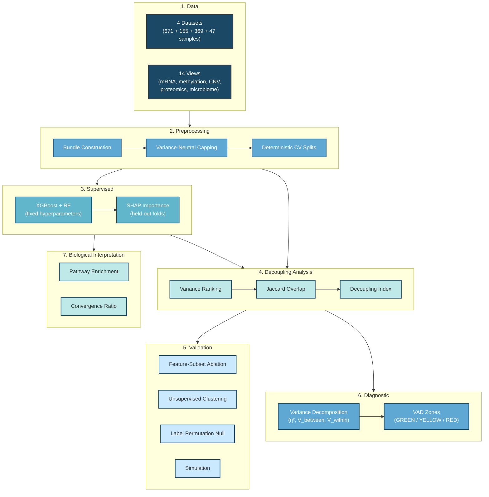

# When Variance Misleads

[](https://www.python.org/)
[](https://opensource.org/licenses/MIT)
[](https://xgboost.readthedocs.io/)

**When Variance Misleads: A Variance–Prediction Paradox in Multi-Omics Biomarker Discovery**

---

## Overview

Selecting highly variable features (genes, CpGs, metabolites) is among the most common preprocessing steps in omics analysis. The implicit assumption is that high variance enriches for biologically informative signal. We test this assumption systematically across four multi-omics datasets and 14 data views.

### Key finding

The variance–prediction relationship partitions into three reproducible regimes: **coupled** (variance filtering is acceptable), **decoupled** (variance filtering is useless), and **anti-aligned** (variance filtering is actively harmful — worse than random selection). In the most affected view (mlomics:methylation at K = 10%), variance-based selection degrades balanced accuracy by 16.2 pp relative to random selection. SHAP-guided selection consistently outperforms variance filtering (mean 8.2 pp; max 26.5 pp across views at K = 10%), while systematically excluding "hidden biomarkers" with strong discriminative signal and low variance.

We introduce the **Decoupling Index (DI)** — the Jaccard overlap between top-K% variance-ranked and top-K% importance-ranked feature sets, normalised against an analytical random expectation so that DI ≈ 1 indicates chance-level overlap (decoupled), DI < 1 indicates coupling, and DI > 1 indicates anti-alignment. We also develop the **Variance Alignment Diagnostic (VAD)**, a label-aware, model-free pre-screening tool (no fitting required) computed on the training split only from variance decomposition statistics — η_ES(K), VSA(K), and PCLA (with SAS as a complementary axis-level measure) — which assigns each view to a GREEN / YELLOW / RED risk zone before any model is trained.

> This repository provides all analysis code for full reproducibility.

---

## Key Results

| Finding | Evidence |
|---------|----------|
| **Variance–importance decoupling is pervasive** | DI ranges from 0.66 (ibdmdb:MPX, coupled) to 1.03 (mlomics:methylation, anti-aligned) at K = 10%; only microbiome taxonomic profiles are consistently coupled |
| **Variance filtering can be worse than random** | mlomics:methylation: Δ(TopVar − Random) = −16.2 pp balanced accuracy (XGBoost, K = 10%); TopVar underperforms random in 7/14 views |
| **Hidden biomarkers are systematically excluded** | Features in the low-variance, high-importance quadrant (Q4, median-split) constitute a mean 17.9% of features across views (range 1.9–25.9%) |
| **Regime is modality × context, not modality alone** | The same modality (e.g. mRNA) can be coupled in one dataset and decoupled in another; 0/3 shared modalities show consistent DI across datasets |
| **VAD predicts harm without model training** | η_ES and PCLA jointly predict ablation harm from training-split statistics alone (PCLA: ρ = 0.538, p = 0.047 under XGBoost) |
| **Cross-model validation** | XGBoost and Random Forest agree on regime direction in 10/14 views (Spearman ρ = 0.79, p = 0.0007) |

---

## Analysis Pipeline



---

## Repository Structure

Every script in this repository either (a) produces a result cited in the manuscript, (b) is a prerequisite computation referenced in Methods, or (c) is a shared library imported by (a) or (b). Scripts are organised into 13 pipeline phases with gap-free sequential numbering within each folder.

| Tier | Count | Description |
|------|-------|-------------|
| Core pipeline | 42 | Produce cited figures, tables, or Methods-referenced outputs |
| Figure scripts | 11 | Generate publication figures (6 main + 4 supplementary + colour utility) |
| Convenience runners | 4 | Orchestrate core scripts in order; aid reproducibility |
| QA / verification | 11 | Post-hoc checks; no cited outputs |
| **Total** | **68** | |

### Core Pipeline (42 scripts)

```
var-pre/
├── README.md
├── requirements.txt
├── environment.yml
├── DATA_ACCESS.md                                    # Data availability note
│
├── _shared/                                          # Shared library modules
│   ├── decoupling_metrics.py                         # DI, Jaccard, overlap metrics
│   ├── vad_metrics.py                                # VAD metric computations (η², VSA, SAS, PCLA)
│   └── io_helpers.py                                 # I/O utilities (NPZ, CSV, paths)
│
├── 00_manifest/                                      # Phase 0 · Data acquisition
│   ├── 01_download_all_data.py                       # Download raw datasets from sources
│   └── 02_verify_downloads.py                        # SHA-256 verification of downloads
│
├── 01_bundles/                                       # Phase 1 · Data preparation
│   ├── 01_prepare_all_bundles.py                     # Raw → NPZ bundles per dataset
│   ├── 02_bundle_integrity_check.py                  # SHA-256 checksums
│   ├── 03_normalize_qc_all_bundles.py                # Domain-standard transforms, imputation, QC
│   └── 04_view_registry.py                           # View metadata registry
│
├── 02_unsupervised/                                  # Phase 2 · Variance analysis
│   ├── 01_total_variance_scores.py                   # Per-feature variance + latent-axis scores
│   ├── 02_pca_embeddings.py                          # PCA embeddings per view
│   └── 03_clustering_comparison.py                   # ARI/NMI: TopVar vs TopSHAP subsets (ST10)
│
├── 03_supervised/                                    # Phase 3 · Model training
│   ├── 01_define_tasks_and_splits.py                 # Stratified k-fold CV splits
│   ├── 02_train_baselines.py                         # LR, SVM, kNN baselines (ST2)
│   ├── 03_train_tree_models.py                       # XGBoost + RF with out-of-fold SHAP
│   └── 04_eval_models.py                             # Consolidate model performance (ST2)
│
├── 04_importance/                                    # Phase 4 · Feature importance
│   ├── 01_compute_shap_cv.py                         # SHAP TreeExplainer per fold
│   ├── 02_aggregate_shap.py                          # Fold-level → view-level SHAP ranks
│   ├── 03_di_uncertainty.py                          # Bootstrap DI confidence intervals (Fig 1d, Fig S1)
│   └── 04_rj_decomposition.py                        # V_between, V_within, η² (Fig 3)
│
├── 05_decoupling/                                    # Phase 5 · Decoupling Index
│   └── 01_decoupling_aggregator.py                   # DI at K ∈ {1,5,10,20}% (Fig 1a,d; Fig 2b; ST3)
│
├── 06_robustness/                                    # Phase 6 · Robustness controls
│   ├── 01_cross_model_shap_agreement.py              # XGB vs RF SHAP rank correlation (Fig 2a; ST5)
│   ├── 02_shap_stability.py                          # Fold-to-fold SHAP stability (Fig S1)
│   └── 03_label_permutation_test.py                  # Label-permuted null distribution (Fig 3e; ST6)
│
├── 07_ablation/                                      # Phase 7 · Feature-subset ablation
│   └── 01_feature_subset_ablation.py                 # TopVar vs TopSHAP vs Random at K% (Fig 4a–c; ST4)
│
├── 08_biology/                                       # Phase 8 · Biological validation
│   ├── 01_gene_mapping_sensitivity.py                # Gene-ID mapping QC
│   ├── 02_pathway_enrichment.py                      # g:Profiler enrichment (ST7)
│   ├── 03_module_overlap.py                          # Gene/pathway Jaccard overlap (Fig 5e; ST7)
│   ├── 04_exemplar_panels_data.py                    # Hidden biomarker feature data (Fig 5a–d)
│   └── 05_convergence_null_model.py                  # Pathway convergence null model (ST7)
│
├── 09_simulation/                                    # Phase 9 · Synthetic validation
│   ├── 01_generate_synthetic.py                      # Synthetic datasets with known regime structure
│   ├── 02_sim_compute_decoupling.py                  # DI on synthetic data (Fig S4c–d; ST9)
│   └── 03_sim_param_sweeps.py                        # ±20% noise parameter sweeps (ST9)
│
├── 11_diagnostic_validation/                         # Phase 11 · VAD calibration
│   ├── 01_calibration_thresholds_zones.py            # VAD zone thresholds (Fig 6a)
│   ├── 02_validation.py                              # Cross-dataset VAD validation
│   └── 03_decision_assets_and_manifests.py           # Decision-tree assets + manifests
│
├── 12_diagnostic/                                    # Phase 12 · VAD computation
│   ├── 01_compute_vad.py                             # Full VAD metric suite per view (ST8)
│   ├── 02_validate_against_ablation.py               # VAD vs ablation harm concordance (Fig 6c–d)
│   ├── 03_plot_vad_panels.py                         # VAD zone map (Fig 6a–d)
│   └── 04_perm_null_diagnostic.py                    # Permutation null for VAD (Fig S4)
│
├── 13_results/                                       # Phase 13 · Supplementary table assembly
│   ├── 01_compile_supplementary_tables.py            # Assemble internal tables from pipeline outputs
│   └── 02_consolidate_supplementary_v2.py            # Renumber + consolidate → manuscript ST1–ST10
│
├── figures/                                          # Publication figure scripts
│   ├── main/
│   │   ├── figure_01_v7.py                           # Fig 1: Variance–prediction paradox
│   │   ├── figure_02_v6.py                           # Fig 2: Regime characterisation
│   │   ├── figure_03_v4.py                           # Fig 3: Mechanistic decomposition
│   │   ├── figure_04_v4.py                           # Fig 4: Cross-model robustness
│   │   ├── figure_5_v9.py                            # Fig 5: Biological interpretation
│   │   └── figure_6_v5.py                            # Fig 6: VAD diagnostic + simulation
│   │
│   └── supp/
│       ├── figure_S1.py                              # Fig S1: SHAP stability + DI uncertainty
│       ├── figure_S2.py                              # Fig S2: Rank–rank atlas
│       ├── figure_S3.py                              # Fig S3: Full ablation landscape
│       └── figure_S4.py                              # Fig S4: VAD calibration + simulation
│
└── _qa/                                              # QA / verification (11 scripts)
    ├── audit_supplementary_assets_v3.py              # Verify supplementary file completeness
    ├── audit_summary.py                              # Pipeline-wide audit summary
    ├── 01_build_paper_numbers.py                     # Extract manuscript numbers for proofreading
    ├── 02_extract_results_claims.py                  # Extract quantitative claims for verification
    ├── 03_verify_paper_consistency.py                # Verify numbers in manuscript match outputs
    ├── 04_stage_figure_inputs.py                     # Stage data inputs for figure scripts
    ├── 04_verify_supplementary_consistency.py        # Verify supplementary tables internally consistent
    ├── 05_check_supp_values.py                       # Spot-check supplementary values
    ├── 06_check_ibdmdb_groups.py                     # Verify IBDMDB group assignments
    ├── 07_triage_perm_vs_shap.py                     # Compare permutation importance vs SHAP ranks
    └── 07_validate_manuscript_claims.py              # Validate all manuscript claims against data
```

### Convenience Runners

Four runner scripts orchestrate their respective phases in a single command:

```
08_biology/00_run_phase8.py
09_simulation/00_run_phase9.py
11_diagnostic_validation/00_run_phase11.py
13_results/00_run_all_results.py
```

---

## Supplementary Tables

All 10 Supplementary Tables are assembled by a two-stage compilation pipeline:
`01_compile_supplementary_tables.py` → `02_consolidate_supplementary_v2.py`.

| ST | Title |
|----|-------|
| ST1 | Dataset and view summary |
| ST2 | Supervised model performance across views (cross-validated) |
| ST3 | Decoupling Index (DI) across feature-selection thresholds |
| ST4 | Feature-selection ablation results (XGBoost and Random Forest) |
| ST5 | Cross-model agreement for DI-defined regimes |
| ST6 | Label-permutation null control |
| ST7 | Gene- and pathway-level convergence between variance- and importance-driven feature sets |
| ST8 | Variance-Alignment Diagnostic (VAD) metrics across feature-selection thresholds |
| ST9 | Simulation regime-recovery validation |
| ST10 | Unsupervised clustering comparison across feature-selection strategies |

---

## Installation

```bash
git clone https://github.com/shoaibms/var-pre.git
cd var-pre

# Option 1: pip
python -m venv venv
.\venv\Scripts\Activate.ps1     # Windows PowerShell
# venv\Scripts\activate.bat     # Windows cmd.exe
# source venv/bin/activate      # macOS/Linux
pip install -r requirements.txt

# Option 2: conda
conda env create -f environment.yml
conda activate var-pre
```

---

## Quick Start: Reproduce Core Results

After activating the environment, run phases sequentially from the project root:

```bash
# 1. Download and verify raw data
python 00_manifest/01_download_all_data.py
python 00_manifest/02_verify_downloads.py

# 2. Build normalised bundles and CV splits
python 01_bundles/01_prepare_all_bundles.py
python 01_bundles/02_bundle_integrity_check.py
python 01_bundles/03_normalize_qc_all_bundles.py

# 3. Compute variance scores and PCA embeddings
python 02_unsupervised/01_total_variance_scores.py
python 02_unsupervised/02_pca_embeddings.py

# 4. Train models and compute SHAP importance
python 03_supervised/01_define_tasks_and_splits.py
python 03_supervised/02_train_baselines.py
python 03_supervised/03_train_tree_models.py
python 03_supervised/04_eval_models.py

# 5. Compute feature importance and decomposition
python 04_importance/01_compute_shap_cv.py
python 04_importance/02_aggregate_shap.py
python 04_importance/03_di_uncertainty.py
python 04_importance/04_rj_decomposition.py

# 6. Compute Decoupling Index
python 05_decoupling/01_decoupling_aggregator.py

# 7. Robustness controls
python 06_robustness/01_cross_model_shap_agreement.py
python 06_robustness/02_shap_stability.py
python 06_robustness/03_label_permutation_test.py

# 8. Feature-subset ablation
python 07_ablation/01_feature_subset_ablation.py

# 9. Biological validation (or: python 08_biology/00_run_phase8.py)
python 08_biology/01_gene_mapping_sensitivity.py
python 08_biology/02_pathway_enrichment.py
python 08_biology/03_module_overlap.py
python 08_biology/04_exemplar_panels_data.py
python 08_biology/05_convergence_null_model.py

# 10. Simulation validation (or: python 09_simulation/00_run_phase9.py)
python 09_simulation/01_generate_synthetic.py
python 09_simulation/02_sim_compute_decoupling.py
python 09_simulation/03_sim_param_sweeps.py

# 11. VAD diagnostic
python 12_diagnostic/01_compute_vad.py
python 12_diagnostic/02_validate_against_ablation.py
python 12_diagnostic/03_plot_vad_panels.py

# 12. Compile supplementary tables
python 13_results/01_compile_supplementary_tables.py
python 13_results/02_consolidate_supplementary_v2.py

# 13. Generate publication figures
python figures/main/figure_01_v7.py
python figures/main/figure_02_v6.py
python figures/main/figure_03_v4.py
python figures/main/figure_04_v4.py
python figures/main/figure_5_v9.py
python figures/main/figure_6_v5.py
python figures/supp/figure_S1.py
python figures/supp/figure_S2.py
python figures/supp/figure_S3.py
python figures/supp/figure_S4.py
```

Each script reads from `outputs/` and writes results back to the corresponding phase subfolder. Figure scripts produce publication-ready PDF/PNG files.

---

## Datasets

| Dataset | n | Views | Task | Source |
|---------|---|-------|------|--------|
| **MLOmics BRCA** | 671 | mRNA, miRNA, methylation, CNV | PAM50 subtype (5 classes) | [HuggingFace AIBIC/MLOmics](https://huggingface.co/datasets/AIBIC/MLOmics) |
| **IBDMDB** | 155 | MGX, MGX_func, MPX, MBX | IBD diagnosis (3 classes) | [ibdmdb.org](https://ibdmdb.org/) |
| **CCLE/DepMap** | 369 | mRNA, CNV, proteomics | Tissue lineage (22 classes) | [DepMap 24Q2](https://depmap.org/portal/) |
| **TCGA-GBM** | 47 | mRNA, methylation, CNV | GBM subtype (4 classes) | [UCSC Xena](https://tcga.xenahubs.net/) |

See [`DATA_ACCESS.md`](DATA_ACCESS.md) for download instructions. Raw datasets are obtained from original providers under their respective terms; this repository includes download and processing code but does not redistribute raw data.

---

## Requirements

| Package | Version |
|---------|---------|
| Python | 3.10.11 |
| NumPy | 2.2.6 |
| pandas | 2.3.3 |
| scikit-learn | 1.7.2 |
| SciPy | 1.15.3 |
| XGBoost | 3.1.3 |
| SHAP | 0.49.1 |
| matplotlib | 3.10.8 |
| joblib | 1.5.3 |
| gprofiler-official | 1.0.0 |

---

## Reproducibility

All stochastic operations use deterministic seeds (base seed 42) with MD5-hashed per-condition seeds to prevent reuse. CV splits are saved to disk and reused across all downstream analyses. Thread counts are pinned (`OMP_NUM_THREADS=1`, `MKL_NUM_THREADS=1`, `OPENBLAS_NUM_THREADS=1`, `NUMEXPR_NUM_THREADS=1`) for deterministic execution under fixed seeds; minor floating-point variation may occur across platforms or BLAS implementations. Data bundles are integrity-checked via SHA-256 hashing. No pickle serialisation is used (`allow_pickle=False` throughout).

---

## Citation

```
Yet to come!
```

---

## License

MIT License — see [LICENSE](LICENSE) for details.

---

## Contact

**Mirza Shoaib** — shoaibmirza2200@gmail.com | shoaib.mirza@agriculture.vic.gov.au

Project: https://github.com/shoaibms/var-pre
