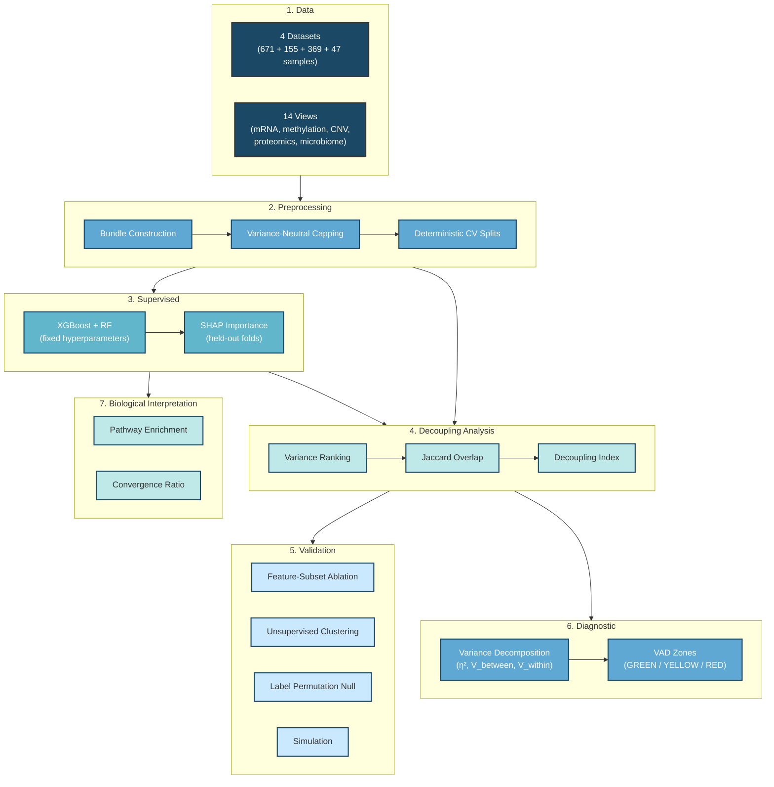

# When Variance Misleads

[](https://www.python.org/)
[](https://opensource.org/licenses/MIT)
[](https://xgboost.readthedocs.io/)

**When Variance Misleads: A Variance–Prediction Paradox in Multi-Omics Biomarker Discovery**

---

## Overview

Selecting highly variable features (genes, CpGs, metabolites) is among the most common preprocessing steps in omics analysis. The implicit assumption is that high variance enriches for biologically informative signal. We test this assumption systematically across four multi-omics datasets and 14 data views.

### Key finding

The variance–prediction relationship partitions into three reproducible regimes: **coupled** (variance filtering is acceptable), **decoupled** (variance filtering is useless), and **anti-aligned** (variance filtering is actively harmful — worse than random selection). In the most affected view (mlomics:methylation at K = 10%), variance-based selection degrades balanced accuracy by 16.2 pp relative to random selection and 24.8 pp relative to SHAP-guided selection (XGBoost), while systematically excluding "hidden biomarkers" with strong discriminative signal and low variance.

We introduce the **Decoupling Index (DI)** — the Jaccard overlap between top-K% variance-ranked and top-K% importance-ranked feature sets, normalised against an analytical random expectation so that DI ≈ 1 indicates chance-level overlap (decoupled), DI < 1 indicates coupling, and DI > 1 indicates anti-alignment. We also develop the **Variance Alignment Diagnostic (VAD)**, a model-free pre-screening tool computed on the training split only from variance decomposition statistics (η², η_ES, PCLA, SAS), which assigns each view to a GREEN / YELLOW / RED risk zone before any model is trained.

> This repository provides all analysis code and figure scripts for full reproducibility.

---

## Key Results

| Finding | Evidence |
|---------|----------|
| **Variance–importance decoupling is pervasive** | DI ranges from 0.66 (ibdmdb:MPX, coupled) to 1.03 (mlomics:methylation, anti-aligned) at K = 10%; only microbiome taxonomic profiles are consistently coupled |
| **Variance filtering can be worse than random** | mlomics:methylation: Δ(TopVar − Random) = −16.2 pp balanced accuracy (XGBoost, K = 10%); TopVar underperforms random in 6/14 views |
| **Hidden biomarkers are systematically excluded** | Features in the low-variance, high-importance quadrant (Q4, median-split) constitute a mean 17.9% of features across views (range 1.9–25.9%) |
| **Regime is modality × context, not modality alone** | The same modality (e.g. mRNA) can be coupled in one dataset and decoupled in another; 0/3 shared modalities show consistent DI across datasets |
| **VAD predicts harm without model training** | η_ES and PCLA jointly predict ablation harm from training-split statistics alone (PCLA: ρ = 0.538, p = 0.047 under XGBoost) |
| **Cross-model validation** | XGBoost and Random Forest agree on regime direction in 10/14 views (Spearman ρ = 0.79, p = 0.0007) |

---

## Analysis Pipeline



---

## Repository Structure

```
var-pre/
├── README.md
├── requirements.txt
│
├── code/
│   ├── compute/
│   │   ├── 00_manifest/
│   │   │   └── download_all_data.py               # Download raw datasets
│   │   │
│   │   ├── 01_bundles/
│   │   │   ├── 01_prepare_all_bundles.py           # Build per-dataset bundles (NPZ)
│   │   │   ├── 03_normalize_qc_all_bundles.py      # Normalize, impute, QC
│   │   │   ├── 04_write_preprocessing_report.py    # Preprocessing summary report
│   │   │   └── 05_view_registry.py                 # View metadata registry
│   │   │
│   │   ├── 02_unsupervised/
│   │   │   ├── 01_total_variance_scores.py         # Compute per-feature variance scores
│   │   │   ├── 02_pca_embeddings.py                # PCA embeddings per view
│   │   │   └── 06_clustering_comparison.py         # KMeans clustering (ARI/NMI)
│   │   │
│   │   ├── 03_supervised/
│   │   │   ├── 01_define_tasks_and_splits.py       # CV split generation (group-aware)
│   │   │   └── 03_train_tree_models.py             # XGBoost + RF training with SHAP
│   │   │
│   │   ├── 04_importance/
│   │   │   ├── 01_compute_shap_cv.py               # Cross-validated SHAP computation
│   │   │   └── 02_aggregate_shap.py                # Aggregate importance across folds
│   │   │
│   │   ├── 05_decoupling/
│   │   │   └── 01_decoupling_aggregator.py         # Compute DI across views and K%
│   │   │
│   │   ├── 06_robustness/
│   │   │   ├── 01_cross_model_shap_agreement.py    # XGBoost vs RF importance agreement
│   │   │   ├── 02_shap_stability.py                # Fold-wise SHAP stability (Jaccard)
│   │   │   └── 03_label_permutation_test.py        # Label-shuffle null control
│   │   │
│   │   ├── 07_ablation/
│   │   │   └── 01_feature_subset_ablation.py       # TopVar vs TopSHAP vs Random ablation
│   │   │
│   │   ├── 08_biology/
│   │   │   ├── 01_gene_mapping_sensitivity.py      # Gene ID extraction from features
│   │   │   ├── 02_pathway_enrichment.py            # g:Profiler pathway enrichment
│   │   │   ├── 03_module_overlap.py                # Gene/pathway Jaccard overlap
│   │   │   └── 06_convergence_null_model.py        # Convergence ratio null model
│   │   │
│   │   ├── 09_simulation/
│   │   │   ├── 01_generate_synthetic.py            # Synthetic coupled/decoupled/anti-aligned
│   │   │   └── 02_sim_compute_decoupling.py        # DI on synthetic data
│   │   │
│   │   ├── 12_diagnostic/
│   │   │   ├── 01_compute_vad.py                   # Variance Alignment Diagnostic
│   │   │   ├── 02_validate_against_ablation.py     # VAD vs ablation harm correlation
│   │   │   └── 04_perm_null_diagnostic.py          # VAD permutation null (200 perms)
│   │   │
│   │   ├── 13_results/
│   │   │   ├── 01_build_paper_numbers.py           # Extract all manuscript numbers
│   │   │   └── 03_verify_paper_consistency.py      # Cross-check figures vs text
│   │   │
│   │   └── _shared/
│   │       ├── decoupling_metrics.py               # DI, Jaccard, regime classification
│   │       ├── vad_metrics.py                       # η², η_ES, VSA, PCLA, SAS, zones
│   │       └── io_helpers.py                        # Bundle I/O, split loading
│   │
│   └── figures/
│       ├── main/
│       │   ├── figure_01_v7.py                     # Fig 1: Variance–prediction paradox
│       │   ├── figure_02_v6.py                     # Fig 2: Regime characterisation
│       │   ├── figure_03_v4.py                     # Fig 3: Mechanistic decomposition
│       │   ├── figure_04_v4.py                     # Fig 4: Cross-model robustness
│       │   ├── figure_5_v9.py                      # Fig 5: Biological interpretation
│       │   └── figure_6_v5.py                      # Fig 6: VAD diagnostic + simulation
│       │
│       └── supp/
│           ├── figure_S1.py                        # Fig S1: SHAP stability
│           ├── figure_S2.py                        # Fig S2: Full ablation grids
│           ├── figure_S3.py                        # Fig S3: Unsupervised validation
│           └── figure_S4.py                        # Fig S4: VAD calibration details
│
├── data/                                           # Raw data (see Data section)
│
└── outputs/                                        # All pipeline outputs (auto-generated)
    ├── 01_bundles/                                 # Normalized bundles + CV splits
    ├── 02_unsupervised/                            # Variance scores, PCA, clustering
    ├── 03_supervised/                              # Model outputs, predictions
    ├── 04_importance/                              # SHAP importance matrices
    ├── 05_decoupling/                              # DI tables, regime summaries
    ├── 06_robustness/                              # Permutation results, stability
    ├── 07_ablation/                                # Ablation performance tables
    ├── 08_biology/                                 # Gene mapping, pathway enrichment
    ├── 09_simulation/                              # Synthetic data + DI results
    ├── 12_diagnostic/                              # VAD outputs, zone classifications
    └── figures/                                    # Publication-ready figures (PDF/PNG)
```

---

## Installation

```bash
git clone https://github.com/shoaibms/var-pre.git
cd var-pre

# Option 1: pip (recommended)
python -m venv venv
venv\Scripts\activate          # Windows
# source venv/bin/activate     # macOS/Linux
pip install -r requirements.txt

# Option 2: conda
conda env create -f environment.yml
conda activate var-pre
```

---

## Quick Start: Reproduce Core Results

After activating the environment, run phases sequentially from the project root:

```bash
# 1. Download raw data
python code/compute/00_manifest/download_all_data.py

# 2. Build normalised bundles and CV splits
python code/compute/01_bundles/01_prepare_all_bundles.py
python code/compute/01_bundles/03_normalize_qc_all_bundles.py
python code/compute/03_supervised/01_define_tasks_and_splits.py

# 3. Compute variance scores
python code/compute/02_unsupervised/01_total_variance_scores.py

# 4. Train models and compute SHAP importance
python code/compute/03_supervised/03_train_tree_models.py

# 5. Compute Decoupling Index
python code/compute/05_decoupling/01_decoupling_aggregator.py

# 6. Feature-subset ablation
python code/compute/07_ablation/01_feature_subset_ablation.py

# 7. VAD diagnostic
python code/compute/12_diagnostic/01_compute_vad.py
python code/compute/12_diagnostic/02_validate_against_ablation.py

# 8. Generate figures
python code/figures/main/figure_01_v7.py
python code/figures/main/figure_02_v6.py
python code/figures/main/figure_03_v4.py
python code/figures/main/figure_04_v4.py
python code/figures/main/figure_5_v9.py
python code/figures/main/figure_6_v5.py
```

Each compute script reads from `outputs/` and writes results back to the corresponding phase subfolder. Figure scripts produce publication-ready PDF/PNG files.

---

## Datasets

| Dataset | n | Views | Task | Source |
|---------|---|-------|------|--------|
| **MLOmics BRCA** | 671 | mRNA, miRNA, methylation, CNV | PAM50 subtype (5 classes) | [HuggingFace AIBIC/MLOmics](https://huggingface.co/datasets/AIBIC/MLOmics) |
| **IBDMDB** | 155 | MGX, MGX_func, MPX, MBX | IBD diagnosis (3 classes) | [ibdmdb.org](https://ibdmdb.org/) |
| **CCLE/DepMap** | 369 | mRNA, CNV, proteomics | Tissue lineage (22 classes) | [DepMap 24Q2](https://depmap.org/portal/) |
| **TCGA-GBM** | 47 | mRNA, methylation, CNV | GBM subtype (4 classes) | [UCSC Xena](https://tcga.xenahubs.net/) |

See `code/GitHub/DATA_ACCESS.md` for download instructions. Raw datasets are obtained from original providers under their respective terms; this repository includes download and processing code but does not redistribute raw data.

---

## Requirements

| Package | Version |
|---------|---------|
| Python | 3.10.11 |
| NumPy | 2.2.6 |
| pandas | 2.3.3 |
| scikit-learn | 1.7.2 |
| SciPy | 1.15.3 |
| XGBoost | 3.1.3 |
| SHAP | 0.49.1 |
| matplotlib | 3.10.8 |
| joblib | 1.5.3 |
| gprofiler-official | 1.0.0 |

---

## Reproducibility

All stochastic operations use deterministic seeds (base seed 42) with MD5-hashed per-condition seeds to prevent reuse. CV splits are saved to disk and reused across all downstream analyses. Thread counts are pinned (`OMP_NUM_THREADS=1`, `MKL_NUM_THREADS=1`) for deterministic execution under fixed seeds; minor floating-point variation may occur across platforms or BLAS implementations. Data bundles are integrity-checked via SHA-256 hashing. No pickle serialisation is used (`allow_pickle=False` throughout).

---

## Citation

```
Yet to come!
```

---

## License

MIT License — see [LICENSE](LICENSE) for details.

---

## Contact

**Mirza Shoaib** — M.Shoaib@latrobe.edu.au | shoaib.mirza@agriculture.vic.gov.au

Project: https://github.com/shoaibms/var-pre
